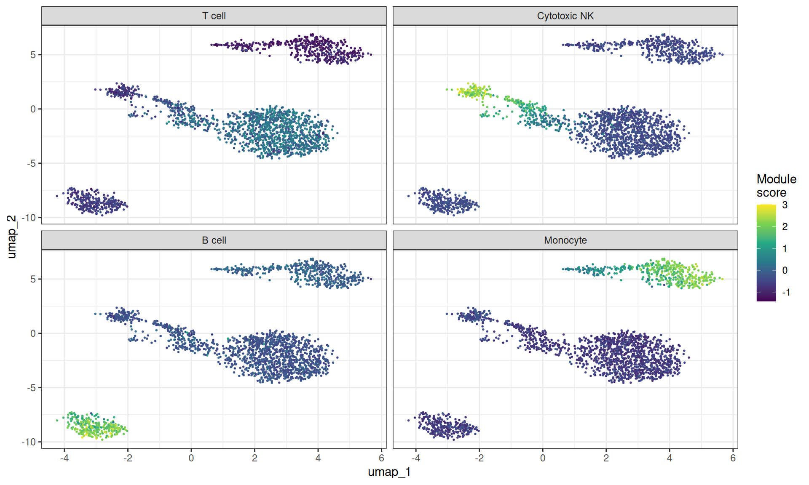
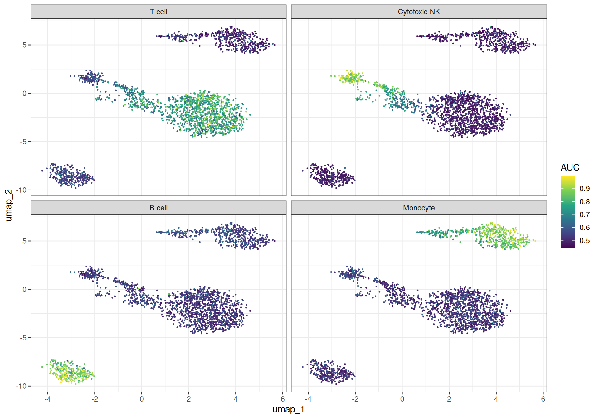

# Gene set analysis and GRN inference on PBMCs

## Intro

This vignette demonstrates the gene set scoring, spatial
autocorrelation, and gene regulatory network (GRN) inference methods
available in `bixverse`. It picks up where the [PBMC
vignette](https://gregorlueg.github.io/bixverse/articles/single_cell_pbmc.html)
left off: QC, normalisation, PCA, nearest neighbours, clustering and
UMAP are all assumed to be done already. If you have not read the
[design
choices](https://gregorlueg.github.io/bixverse/articles/design_single_cell.html)
and the [introductory
vignette](https://gregorlueg.github.io/bixverse/articles/thinking_single_cell.html),
please do so first.

The methods fall into two broad categories:

- The first, module scores, AUCell, and VISION, takes *pre-defined* gene
  sets and scores them per cell.
- The second, Hotspot and SCENIC, *discovers* gene programmes and
  regulatory relationships from the data itself.

We use the PBMC3k dataset throughout. At 2,700 cells this is likely too
small for the GRN methods to produce biologically meaningful results,
but it is large enough to show the API and the workflow end to end. On
real datasets with tens of thousands of cells the same code applies
unchanged. Also, as the

``` r
library(bixverse)
library(ggplot2)
library(data.table)
library(magrittr)
```

> **Note**
>
> The vignette was built on a GitHub runner which is a 2-core machine
> with ~8 GB of memory. That this works is incredible enough, but take
> this into account when looking at this vignette.

### Rebuilding the processed object

We reconstruct the processed `SingleCells` object from the PBMC
vignette. The chunk is hidden for brevity: it downloads the data, runs
QC, HVG selection, PCA, neighbour computation, Leiden clustering and
UMAP.

Rebuild the PBMC3k object (click to expand)

``` r
pbmc3k_path <- bixverse:::download_pbmc3k()
tempdir_pbmc <- tempdir()

sc_object <- SingleCells(dir_data = tempdir_pbmc)
mtx_io_params <- get_cell_ranger_params(pbmc3k_path)

sc_object <- load_mtx(
  object = sc_object,
  sc_mtx_io_param = mtx_io_params,
  streaming = FALSE,
  .verbose = FALSE
)

setnames_sc(sc_object, table = "var", old = "column1", new = "gene_symbol")

var <- get_sc_var(sc_object)
ensembl_to_symbol <- setNames(var$gene_symbol, var$gene_id)
symbol_to_ensembl <- setNames(var$gene_id, var$gene_symbol)

# gene set proportions for QC
gs_of_interest <- list(
  MT = var[grepl("^MT-", gene_symbol), gene_id],
  Ribo = var[grepl("^RPS|^RPL", gene_symbol), gene_id]
)
sc_object <- gene_set_proportions_sc(
  sc_object,
  gs_of_interest,
  streaming = FALSE,
  .verbose = FALSE
)

# MAD QC
qc_df <- sc_object[[c("cell_id", "lib_size", "nnz", "MT")]]
metrics <- list(
  log10_lib_size = log10(qc_df$lib_size),
  log10_nnz = log10(qc_df$nnz),
  MT = qc_df$MT
)
directions <- c(
  log10_lib_size = "twosided",
  log10_nnz = "twosided",
  MT = "above"
)
qc <- run_cell_qc(metrics, directions, threshold = 3)
sc_object[["outlier"]] <- qc$combined
cells_to_keep <- qc_df[!qc$combined, cell_id]
sc_object <- set_cells_to_keep(sc_object, cells_to_keep)

# HVG, PCA, neighbours, clustering, UMAP
sc_object <- find_hvg_sc(sc_object, hvg_no = 2000L, .verbose = FALSE)
sc_object <- calculate_pca_sc(sc_object, no_pcs = 30L, sparse_svd = TRUE)
#> Using sparse SVD solving on scaled data on 2000 HVG.
sc_object <- find_neighbours_sc(
  sc_object,
  neighbours_params = params_sc_neighbours(
    knn = list(knn_method = "exhaustive")
  )
)
#> 
#> Generating sNN graph (full: FALSE).
#> Transforming sNN data to igraph.
sc_object <- find_clusters_sc(sc_object, res = 1.5, name = "leiden_clusters")
sc_object <- umap_sc(sc_object, knn_method = "annoy")
#> Running UMAP.
#> Using n_epochs = 500 (dataset <10k samples or adam_parallel optimiser)
#> Using provided kNN graph.

# UMAP coordinates for reuse
umap_dt <- as.data.table(
  get_embedding(sc_object, "umap"),
  keep.rownames = "cell_id"
)
```

## Gene set scoring

### Module scores

The simplest approach to gene set activity is the module score from
[Tirosh et
al. (2016)](https://www.science.org/doi/10.1126/science.aad0501): for
each cell, compute the mean expression of the gene set and subtract the
mean expression of a size-matched control set drawn from the same
expression bins. We will just use some lineage-specific genes to have
pretty visualisations.

``` r
lineage_sets <- list(
  `T cell` = symbol_to_ensembl[c(
    "CD3D",
    "CD3E",
    "CD3G",
    "CD2",
    "IL7R",
    "CD7",
    "LEF1",
    "TCF7",
    "LTB",
    "TRAC"
  )],
  `Cytotoxic NK` = symbol_to_ensembl[c(
    "NKG7",
    "GNLY",
    "GZMA",
    "GZMB",
    "GZMH",
    "PRF1",
    "CST7",
    "KLRD1",
    "KLRB1",
    "FGFBP2"
  )],
  `B cell` = symbol_to_ensembl[c(
    "CD79A",
    "CD79B",
    "MS4A1",
    "BANK1",
    "IGHM",
    "IGHD",
    "CD74",
    "HLA-DQA1",
    "TCL1A",
    "VPREB3"
  )],
  `Monocyte` = symbol_to_ensembl[c(
    "CD14",
    "LYZ",
    "S100A8",
    "S100A9",
    "S100A12",
    "CST3",
    "FCN1",
    "VCAN",
    "MNDA",
    "TYROBP"
  )]
)

# drop any NAs
lineage_sets <- lapply(lineage_sets, function(x) x[!is.na(x)])

module_scores <- module_scores_sc(
  object = sc_object,
  gs_list = lineage_sets,
  .verbose = FALSE
)

ms_dt <- as.data.table(module_scores, keep.rownames = "cell_id")
ms_dt <- merge(ms_dt, umap_dt, by = "cell_id")

ms_long <- melt(
  ms_dt,
  id.vars = c("cell_id", "umap_1", "umap_2"),
  measure.vars = names(lineage_sets),
  variable.name = "phase",
  value.name = "score"
)

ggplot(ms_long, aes(x = umap_1, y = umap_2)) +
  geom_point(aes(colour = score), size = 0.3) +
  scale_colour_viridis_c() +
  facet_wrap(~phase, ncol = 2) +
  theme_bw() +
  labs(colour = "Module\nscore")
```



Module scores for lineage genes projected onto UMAP

### AUCell

[AUCell](https://www.nature.com/articles/nmeth.4463) ranks genes within
each cell by expression and computes the area under the recovery curve
for the gene set. This is more robust to outliers than a simple mean.
`bixverse` provides two flavours: a Wilcoxon-statistic-based AUC and a
standard AUROC. The two are highly correlated; we show the Wilcoxon
variant here.

``` r
auc_scores <- aucell_sc(
  object = sc_object,
  gs_list = lineage_sets,
  auc_type = "wilcox",
  .verbose = FALSE
)

auc_dt <- as.data.table(auc_scores, keep.rownames = "cell_id")
auc_dt <- merge(auc_dt, umap_dt, by = "cell_id")

auc_long <- melt(
  auc_dt,
  id.vars = c("cell_id", "umap_1", "umap_2"),
  measure.vars = names(lineage_sets),
  variable.name = "phase",
  value.name = "auc"
)

ggplot(auc_long, aes(x = umap_1, y = umap_2)) +
  geom_point(aes(colour = auc), size = 0.3) +
  scale_colour_viridis_c() +
  facet_wrap(~phase) +
  theme_bw() +
  labs(colour = "AUC")
```



AUCell scores for lineage genes projected onto UMAP

### VISION with spatial autocorrelation

Scoring gene sets is useful, but a natural follow-up question is: *are
these scores spatially structured on the cell neighbourhood graph, or
just noise?*
[VISION](https://www.nature.com/articles/s41467-019-12235-0) provides a
permutation-based test of spatial autocorrelation (Geary’s C) on the kNN
graph. Gene sets with significant autocorrelation are those whose
activity varies smoothly across cell neighbourhoods – a strong
indication that the signal is biologically meaningful rather than
random.

VISION expects gene sets in a signed format with `pos` and (optionally)
`neg` components. In the cause of our cell lineage genes, we could use
the other cell type’s markers as negatives, but we will just leave it
blank here.

``` r
vision_gs <- lapply(lineage_sets, function(genes) list(pos = genes))

vision_res <- vision_w_autocor_sc(
  object = sc_object,
  gs_list = vision_gs,
  embd_to_use = "pca",
  vision_params = params_sc_vision(n_perm = 500L),
  .verbose = TRUE
)
#> Generating 5 random gene set clusters with a total of 500 permutations.

head(vision_res$auto_cor_dt)
#>    gene_set_name  auto_cor       p_val         fdr
#>           <char>     <num>       <num>       <num>
#> 1:        T cell 0.7567330 0.001996008 0.002661344
#> 2:  Cytotoxic NK 0.4578573 0.009980040 0.009980040
#> 3:        B cell 0.5719954 0.001996008 0.002661344
#> 4:      Monocyte 0.5574494 0.001996008 0.002661344
```

Unsurprisingly, all of these gene sets show highly significant spatial
correlation.

## Hotspot

Where the methods above test *pre-defined* gene sets, Hotspot ([DeTomaso
& Yosef,
2021](https://www.cell.com/cell-systems/fulltext/S2405-4712(21)00114-9))
discovers gene programmes *de novo* by testing each gene for spatial
autocorrelation on the kNN graph and then grouping the significant genes
by their local correlation structure.

### Gene autocorrelation

The first step computes Geary’s C for every gene against the neighbour
graph. Genes with significant autocorrelation are those whose expression
varies smoothly across neighbouring cells, i.e., genes that mark
spatially coherent programmes.

``` r
hotspot_autocor <- hotspot_autocor_sc(
  object = sc_object,
  .verbose = FALSE
)

hotspot_autocor[, gene_symbol := ensembl_to_symbol[gene_id]]

head(hotspot_autocor[order(fdr)], 20L)
#>             gene_id  gaerys_c   z_score  pval   fdr gene_symbol
#>              <char>     <num>     <num> <num> <num>      <char>
#>  1: ENSG00000163131 0.5366704  42.91443     0     0        CTSS
#>  2: ENSG00000163220 0.7227550  66.40006     0     0      S100A9
#>  3: ENSG00000143546 0.6843619  67.94913     0     0      S100A8
#>  4: ENSG00000197956 0.5665500  60.65715     0     0      S100A6
#>  5: ENSG00000196154 0.6060381  63.34048     0     0      S100A4
#>  6: ENSG00000177954 0.5416304  73.15880     0     0       RPS27
#>  7: ENSG00000158869 0.6635526  57.40015     0     0      FCER1G
#>  8: ENSG00000203747 0.5669235  49.57281     0     0      FCGR3A
#>  9: ENSG00000198821 0.2257676  53.26115     0     0       CD247
#> 10: ENSG00000143185 0.3176146  52.36552     0     0        XCL2
#> 11: ENSG00000143184 0.3614059  64.42469     0     0        XCL1
#> 12: ENSG00000143947 0.3309339  45.01256     0     0      RPS27A
#> 13: ENSG00000115523 0.6002206 125.16958     0     0        GNLY
#> 14: ENSG00000153563 0.2413224  45.56978     0     0        CD8A
#> 15: ENSG00000172116 0.2275551  42.96094     0     0        CD8B
#> 16: ENSG00000071082 0.3411410  48.68288     0     0       RPL31
#> 17: ENSG00000144713 0.3609850  56.28975     0     0       RPL32
#> 18: ENSG00000233276 0.4705684  43.87033     0     0        GPX1
#> 19: ENSG00000196542 0.3204369  52.86151     0     0      SPTSSB
#> 20: ENSG00000159674 0.4989858  94.22457     0     0       SPON2
#>             gene_id  gaerys_c   z_score  pval   fdr gene_symbol
#>              <char>     <num>     <num> <num> <num>      <char>
```

Known PBMC markers (LYZ, CD3D, NKG7, etc.) should appear among the top
hits.

### Gene-gene local correlations and modules

Taking the significant genes forward, we compute pairwise local
correlations and cluster them into modules. Each module represents a
group of genes that are not only individually autocorrelated but also
co-vary locally - a much stronger signal than global correlation alone.

``` r
sig_genes <- hotspot_autocor[fdr <= 0.05, gene_id]

hotspot_cor <- hotspot_gene_cor_sc(
  object = sc_object,
  genes_to_take = sig_genes,
  .verbose = TRUE
)

hotspot_cor
#> Hotspot gene-gene local correlation results
#>   Genes: 2083
#>   Cells: 2163
#>   Modules: not yet computed (see generate_hotspot_membership)
```

This returns a HotSpot result. Let’s add the membership and plot it.

``` r
hotspot_cor <- generate_hotspot_membership(hotspot_cor)

# this will only plot a subsample of 500 genes for speed (stratified by
# module). You can control this via a parameter in the plotting function
plot(hotspot_cor)
```


Let’s pull out the genes:

``` r
membership <- get_hotspot_membership(hotspot_cor)
membership[, gene_symbol := ensembl_to_symbol[gene_id]]

membership <- membership[!is.na(cluster_member)]

head(membership[order(cluster_member)], 20L)
#>             gene_id cluster_member  gene_symbol
#>              <char>          <num>       <char>
#>  1: ENSG00000117155            557       SSX2IP
#>  2: ENSG00000117586            557       TNFSF4
#>  3: ENSG00000150681            557        RGS18
#>  4: ENSG00000187699            557      C2orf88
#>  5: ENSG00000168497            557         SDPR
#>  6: ENSG00000088726            557       TMEM40
#>  7: ENSG00000169704            557          GP9
#>  8: ENSG00000163737            557          PF4
#>  9: ENSG00000163736            557         PPBP
#> 10: ENSG00000245954            557 RP11-18H21.1
#> 11: ENSG00000158985            557     CDC42SE2
#> 12: ENSG00000113140            557        SPARC
#> 13: ENSG00000176783            557        RUFY1
#> 14: ENSG00000272053            557 RP11-367G6.3
#> 15: ENSG00000180573            557    HIST1H2AC
#> 16: ENSG00000204420            557      C6orf25
#> 17: ENSG00000161911            557       TREML1
#> 18: ENSG00000171611            557        PTCRA
#> 19: ENSG00000223855            557   AC147651.3
#> 20: ENSG00000122566            557    HNRNPA2B1
#>             gene_id cluster_member  gene_symbol
#>              <char>          <num>       <char>
```

The resulting modules should roughly correspond to the major cell-type
programmes in PBMCs (T cell, monocyte, B cell, NK cell signatures,
etc.). Let’s visualise this with AUCell check it out.

``` r
hotspot_gene_sets <- membership %$% split(gene_id, cluster_member)

hotspot_gene_sets <- lapply(hotspot_gene_sets, function(genes) {
  list(pos = genes)
})

vision_scores_hotspot <- vision_sc(
  object = sc_object,
  gs_list = hotspot_gene_sets,
  .verbose = FALSE
)

vision_scores_dt <- as.data.table(
  vision_scores_hotspot,
  keep.rownames = "cell_id"
)
vision_scores_dt <- merge(vision_scores_dt, umap_dt, by = "cell_id")


vision_scores_long <- melt(
  vision_scores_dt,
  id.vars = c("cell_id", "umap_1", "umap_2"),
  measure.vars = names(hotspot_gene_sets),
  variable.name = "gene_set",
  value.name = "vision_score"
)

# min max individually for prettier visualisations
vision_scores_long[,
  vision_score_scaled := (vision_score - min(vision_score)) /
    (max(vision_score) - min(vision_score)),
  by = gene_set
]

ggplot(vision_scores_long, aes(x = umap_1, y = umap_2)) +
  geom_point(aes(colour = vision_score_scaled), size = 0.3) +
  scale_colour_viridis_c() +
  facet_wrap(~gene_set) +
  theme_bw() +
  labs(colour = "Vision (scaled)")
```


## SCENIC

[SCENIC](https://www.nature.com/articles/nmeth.4463) infers gene
regulatory networks by asking: for each gene, which transcription
factors (TFs) best predict its expression? The original implementation
uses either random forests or GRNBoost2 (gradient boosted trees) to
regress each target gene on all TFs, then extracts feature importances
as a proxy for regulatory strength.

The `bixverse` implementation re-implements this in Rust with several
optimisations that make the RF and ExtraTrees paths substantially faster
than the single-target-at-a-time approach used by GRNBoost2:

- **Quantisation**: TF expression values are discretised into 256 bins
  (u8), so histogram construction during tree building operates on
  single bytes and fits comfortably in L1 cache.
- **Multi-output batching**: up to 64 target genes share a single tree
  structure. The histogram construction cost is paid once per node per
  feature, but the split score aggregates variance reduction across all
  targets in the batch. This amortises the dominant cost of tree
  building across targets.
- **Correlated gene batching**: rather than assigning genes to batches
  randomly, an optional SVD + k-means step groups co-expressed genes
  together so that the shared tree structure is more informative for
  each target in the batch.
- **GRNBoost2 with histogram subtraction**: for the gradient boosted
  path (single-target), the code builds full-feature histograms at each
  node and derives the larger child via parent-minus-smaller
  subtraction, avoiding a redundant scan of the larger child’s samples.
  OOB early stopping prevents overfitting and is the main source of
  speedup.

On the 2,700-cell PBMC3k dataset these optimisations are not that
noticeable… The data is too small for any method to take long. On
datasets with tens of thousands of cells and thousands of TFs, the RF/ET
multi-output path comfortably outperforms GRNBoost2. You need to just
decide if you are okay with the batching of genes. Generally speaking,
the big signals will be recovered again and again (from empirical
testing).

### Gene filtering

SCENIC first filters genes by minimum total counts and minimum
proportion of expressing cells to remove uninformative targets.

``` r
scenic_genes <- scenic_gene_filter_sc(
  object = sc_object,
  scenic_params = params_scenic(min_counts = 50L),
  .verbose = FALSE
)

length(scenic_genes)
#> [1] 5430
```

### Transcription factor list

We need a list of known TFs. The Aerts lab provides a curated list for
human which we can download and map to Ensembl IDs.

``` r
tf_dt <- data.table::fread(
  "https://resources.aertslab.org/cistarget/tf_lists/allTFs_hg38.txt",
  header = FALSE,
  col.names = "tf"
)
tf_dt[, gene_id := symbol_to_ensembl[tf]]
tf_dt <- tf_dt[!is.na(gene_id)]

nrow(tf_dt)
#> [1] 1100
```

### GRN inference

With genes and TFs in hand, we run the GRN inference step. Here we use
random forests with a batch size of 64 to illustrate the multi-output
path.

``` r
scenic_res <- scenic_grn_sc(
  object = sc_object,
  tf_ids = tf_dt$gene_id,
  genes_to_take = scenic_genes,
  scenic_params = params_scenic(
    learner_type = "randomforest",
    gene_batch_size = 64L
  ),
  .verbose = TRUE
)
#> SCENIC: 5430 target genes, 466 TFs, 2163 cells

scenic_res
#> ScenicGrn (GRN results)
#>   No genes:                 5430 
#>   No TFs:                   466 
#>   Applied learner:          randomforest 
#>   TF to gene generated:     FALSE 
#>   CisTarget res generated:  FALSE
```

If you are bored, you can run both methods
(`learner_type = "grnboost2"`) and compare the importance scores. You
will see very high correlations here (and can explore the speed
differences…)

### TF-to-gene refinement

The raw importance matrix is large and noisy. The next steps winnow it
down to a candidate regulatory network by keeping only the top TF-gene
pairs and filtering by pairwise expression correlation. The approach
used here is that per gene only TFs with an
`importance score ≥ mean(importance_score) + n_sd * sd(importance_score)`
per given gene are kept. Note that `n_sd` should be adjusted depending
on the learner: RF and ExtraTrees spread importance more evenly across
TFs than GRNBoost2, so a lower threshold (e.g. `n_sd = 1`) is
appropriate, whereas GRNBoost2 concentrates importance onto fewer TFs
and tolerates `n_sd = 1.5` or even `n_sd = 2`.

``` r
scenic_res <- identify_tf_to_genes(
  scenic_res,
  n_sd = 2,
  .verbose = TRUE
)
#> Extracting TF to gene associations via per-gene threshold (mean + 2.0 * SD).

scenic_res <- tf_to_genes_correlations(
  x = scenic_res,
  object = sc_object,
  cor_filter = 0.01,
  .verbose = TRUE
)
#> Calculating the pairwise correlations between the TFs and genes
#> Removing TF <> gene pairs with cors <= 0.010
#> Removing self loops (TF controlling its own expression

tf_gene_dt <- get_tf_to_gene(scenic_res)
tf_gene_dt[, tf_symbol := ensembl_to_symbol[tf]]
tf_gene_dt[, gene_symbol := ensembl_to_symbol[gene]]

head(tf_gene_dt[order(-importance)], 5L)
#>                 tf            gene importance pairwise_cor tf_symbol
#>             <char>          <char>      <num>        <num>    <char>
#> 1: ENSG00000171223 ENSG00000120129  0.2730128    0.3743879      JUNB
#> 2: ENSG00000170345 ENSG00000120129  0.2646697    0.3395905       FOS
#> 3: ENSG00000139187 ENSG00000113088  0.2429312    0.2531497     KLRG1
#> 4: ENSG00000066336 ENSG00000181444  0.2389428    0.2116035      SPI1
#> 5: ENSG00000221869 ENSG00000115828  0.2366143    0.2871167     CEBPD
#>    gene_symbol
#>         <char>
#> 1:       DUSP1
#> 2:       DUSP1
#> 3:        GZMK
#> 4:      ZNF467
#> 5:        QPCT
```

### CisTarget motif enrichment

The final (and optional) step in the SCENIC pipeline validates the
predicted TF-gene links against known motif binding sites. This requires
downloading the CisTarget motif ranking database and motif-to-TF
annotation files from the [Aerts lab
resources](https://resources.aertslab.org/cistarget/), which together
are roughly 1.5 GB. We therefore show the code but do not evaluate it by
default.

``` r
# Download the CisTarget reference files (cached after first download)
paths <- download_cistarget_hg38()

rankings <- read_motif_ranking(paths$rankings)
annotations <- read_motif_annotation_file(paths$motif_annotations)

# Run motif enrichment on the TF-gene links
scenic_res <- tf_to_genes_motif_enrichment(
  x = scenic_res,
  motif_rankings = rankings,
  annot_data = annotations,
  # we store everything as Ensembl... The SCENIC data has gene symbols, hence,
  # the need to provide conversion
  gene_id_to_symbol = ensembl_to_symbol,
  cis_target_params = params_cistarget(
    nes_threshold = 3.0
  ),
  only_high_conf_tf = FALSE,
  .verbose = TRUE
)

# CisTarget results per TF
cistarget_dt <- get_cistarget_res(scenic_res)
head(cistarget_dt[order(-nes)])

# The TF-to-gene table now has a leading_edge column indicating which
# genes fall within the motif recovery curve
tf_gene_final <- get_tf_to_gene(scenic_res)

head(tf_gene_final[(in_leading_edge)][order(-importance)])
```

This is how you work with all types of `"bag of genes"` analyses for
single cell in `bixverse`.

## Clean up

``` r
unlink(tempdir_pbmc, recursive = TRUE, force = TRUE)
```
