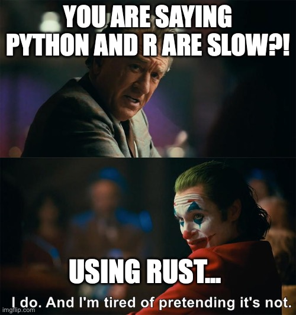

# Technical design choices for the single cell implementation

*This is an opinionated piece, so take what is written here with a pinch
of salt. The statements here reflect my personal opinions, not those of
any of my past, current, or future employers.*

## Why do we need yet another single cell framework … ?


Why the hell would you write a single cell framework from scratch and
not use one of the established libraries? We have in R
[Seurat](https://satijalab.org/seurat/), in the BioConductor universe
[single cell experiments](https://bioconductor.org/books/release/OSCA/);
in Python [ScanPy](https://scanpy.readthedocs.io/en/stable/) and even
now GPU-accelerated
[RAPIDS-singlecell](https://rapids-singlecell.readthedocs.io/en/latest/)
leveraging CUDA and Nvidia GPUs. In Rust, we have
[SingleRust](https://singlerust.com) which is porting ScanPy over… What
the hell is the point, you might ask? Well, the design philosophy in
this package is quite different from all of the above — whether better
or worse you shall discover, but it *is* different. Let’s start with the
problem though…

### Chapter 1: Single cell is just not (very) performant (on CPU)…

Some quotes from recent papers:

> We benchmarked rapids-singlecell on 1 million cells from the 10x
> Genomics mouse brain dataset, running a standard workflow:
> preprocessing, normalization, HVG selection, dimensionality reduction
> (PCA, UMAP, t-SNE), neighborhood graph construction, and Leiden
> clustering (Methods). **On a 32-core workstation, the pipeline took
> over 52 minutes (Methods)** \[…\]
>
> — [Dicks, et al., arXiv, 2026](https://arxiv.org/abs/2603.02402)

> For instance, a typical single-cell data analysis pipeline —
> encompassing data integration, clustering, visualisation, and
> differential expression analysis — requires about 16 h to process half
> a million cells on a standard desktop. When the cell number slightly
> increases to 600,000, **the above pipeline can crash due to memory
> exceeding, even on a professional computing platform with 512 GB RAM**
>
> — [Li, et al., Nat Comm,
> 2025](https://www.nature.com/articles/s41467-025-56424-6)

Anyone who has worked with more than 500k cells can attest to it being
painful. Actually VERY painful. The question is… why? Why can analytical
engines like [DuckDB](https://duckdb.org) and [polars](https://pola.rs)
handle massive data sets without needing fat memory machines? You can
easily analyse hundreds of millions of rows on a local laptop with those
two. Why can we not do the same with single cell? Is the answer really
“Bro, just throw more cores, memory, and GPUs at the problem”? Or is it
time to rethink **HOW** we are doing this.

### Chapter 2: Do not keep data in memory…

Let’s do some maths. Say we have a single cell experiment with 1M cells,
with on average 1000 genes detected per cell. What actually happens to
our memory? Worst case: R with its double precision floats.

    # raw counts
    x     (values, double in R by default):  1B × 8 bytes = 8 GB
                           (int32 if lucky): 1B × 4 bytes = 4 GB
    i     (row indices, int32):              1B × 4 bytes = 4 GB
    p     (col pointers, int32):             (1M+1) × 4   ~ 4 MB

    Total: ~12 GB (double) / ~8 GB (int32)

    # norm counts
    For sure double, so 12 GB

    # scaled counts with 2k HVG (if 3k, just increase this by 50%)
    2k HVGs:  1M × 2,000 × 8 bytes = 16 GB

    # embeddings
    PCA:              1M × 50 × 8 = 400 MB
    Batch correction: 1M × 50 × 8 = 400 MB

    Total: ~800 MB

    # kNN graph
    indices (int32):    20M × 4 = 80 MB
    data (double):      20M × 8 = 160 MB
    indptr (int32):      1M × 4 =   4 MB

    Total: ~244 MB

    # sNN graph
    Same as kNN graph ~244 MB

You are already looking at 40+ GB of occupied memory. Then you have some
horrible tibbles with 1M rows; throw in a bunch of string columns and
you are adding another 250–500 MB in nasty situations. Now add R’s
copy-on-modify semantics and suddenly everything becomes unbearably
slow, memory hungry, and you end up with bloated objects storing data
you rarely actually need in memory. The question is: should we be doing
any of this? Why do we keep raw and normalised counts in memory at all?
[BPCells](https://github.com/bnprks/BPCells) is going in the right
direction here, but can we do even better?

### Chapter 3: Python and R are slow…



There. It has been said. They are slow and let us stop pretending
otherwise. Yes, you can drop into NumPy or Rcpp for the heavy lifting —
but that argument rather proves the point! The real problem is not any
single kernel; it is what happens between them.

A lot of algorithms in practice end up looking like this:

    R/Python → low-level kernel → R/Python → low-level kernel → R/Python → ...

Each arrow is a context switch. Data gets passed across a language
boundary, some “simple” bookkeeping happens in the interpreter — a
filter here, a reshape there, maybe a quick normalisation — and then you
hand it back down again. None of those individual steps looks expensive.
Collectively, they are death by a thousand cuts: repeated allocations,
data copies you did not ask for, and the interpreter’s garbage collector
doing God knows what in between. You also lose any hope of the compiler
reasoning across those boundaries and optimising the full pipeline.

The solution is not to make the interpreted bits faster. It is to keep
the data in low-level code for as long as possible and only surface
results to R when the user actually needs to look at something. R then
becomes a thin orchestration layer, not an active participant in the
computation.

## What is your proposal then … ?

Okay, everything so far reads like a rant. What is the solution, mate?

### Let’s not keep data in memory to start with … ?

If we think this through, we can arrive at a solution. Ideally, we want
an interface from an interpreted, dynamically typed language: going
all-in on Rust is just too heavy. The average person does not want to
deal with the borrow checker, does not want to compile code, and wants
to quickly analyse and iterate over data. The average bioinformatician
lives in blissful ignorance and will not be able to comment on `f32` vs
`f64` float representation in memory, and frankly should not have to.
That means the interface should be a dynamically typed, interpreted
language. This opens the package up to more people and makes plotting
(ggplot2 for the win) much easier. From there we can make some design
decisions.

1.  ***We do not keep data in memory if not needed!*** Most analyses
    leveraging counts only need subsets of cells and genes. We can also
    avoid holding metadata in memory via DuckDB. Data will be streamed
    from disk when needed and Rust’s compiler will free memory once it
    is no longer needed — sometimes enforced explicitly with
    [`drop()`](https://rdrr.io/r/base/drop.html). Raw counts? Nope.
    Normalised counts? Nope. Scaled counts? Nope. We just removed 40 GB
    of unnecessary stuff from memory (in our 1M cell example). Data can
    be loaded into memory in milliseconds if need be.

2.  ***We do not even load all data into memory to begin with.*** In
    99.99% of cases, we know we do not want low quality cells with tiny
    library sizes and few unique features. We also almost always do the
    usual library-size-to-target-size normalisation with log
    transformation. (Anyone who has tried fancy Pearson residual
    modelling on large data sets knows what I am talking about.) That
    means when reading h5ad or mtx files, we can pre-scan them, take
    only what we want, and normalise in a single pass — avoiding the
    load-everything, then-filter, then-normalise pattern.

3.  ***We accept that single cell is noisy*** and do not bother with
    `f32` or even `f64` precision for storage. For raw counts, `u16` is
    sufficient most of the time. The ML field has shown that you can get
    away with `f16`, which reduces memory pressure and I/O substantially
    — and they are pushing quantisation even further than that.

4.  ***We are not doing any heavy calculations in R (or Python — future
    roadmap).*** Rust is superior for speed and optimisation: aggressive
    multi-threading, no copy-on-modify semantics, tight memory control,
    and SIMD acceleration for specific bottlenecks (distance
    calculations, averaging, summing, normalising). R here is just an
    interface, telling the underlying Rust code what to do.

But if the data is not in memory, will this not be slow? Well, no. We
store data in structures like this. One for cells:

``` rust
/// CsrCellChunk
///
/// This structure is designed to store the data of a single cell in a
/// CSR-like format optimised for rapid access on disk.
#[derive(Debug)]
pub struct CsrCellChunk {
    pub data_raw: RawCounts,
    pub data_norm: Vec<F16>,
    pub library_size: usize,
    pub indices: Vec<u32>,
    pub original_index: usize,
    pub to_keep: bool,
}
```

One for genes (if you are even vaguely familiar with compressed sparse
formats, you have probably already clocked that this is essentially CSR
and CSC storage with two data layers):

``` rust
/// CscGeneChunk
///
/// This structure is designed to store the data of a single gene in a
/// CSC-like format optimised for rapid access on disk.
#[derive(Encode, Decode, Serialize, Deserialize, Debug)]
pub struct CscGeneChunk {
    pub data_raw: RawCounts,
    pub data_norm: Vec<F16>,
    pub avg_exp: F16,
    pub nnz: usize,
    pub indices: Vec<u32>,
    pub original_index: usize,
    pub to_keep: bool,
}
```

But you are duplicating the data! Yep, indeed. But this allows extremely
efficient retrieval. Want to run DGE between two groups? Only those
cells are loaded via `CsrCellChunk`s. Want to iterate over genes to
identify HVGs? That goes through `CscGeneChunk`. A further advantage is
that for quite a few analyses, we can load subsets and stream over the
data rather than reading everything at once, which massively reduces the
memory footprint. We still use
[lz4](https://en.wikipedia.org/wiki/LZ4_(compression_algorithm))
compression to reduce the on-disk footprint, but the core philosophy is:

> **Disk space is cheap; memory ain’t**

This approach allows fast loading of raw or normalised counts depending
on what is needed, and the two-layer approach (heavily inspired by
TileDB) means we avoid duplicating indices and indptr. This assumes
decent SSD speeds, but most modern hardware has that covered.

### Let’s not round trip into interpreted languages

Continuing from step 4, we avoid round trips to R entirely. This
sidesteps R quirks like copy-on-modify. The typical approximate nearest
neighbour library used in R (Annoy) actually writes the index to disk —
which was Spotify’s original design and made total sense for their use
case — but why are we doing this in R? No idea. The core philosophy is
to take a hard look at the algorithms and methods used and, where
needed, implement a highly specialised version for single cell. Some
examples:

- Custom implementation of various kNN searches, all running in Rust:
  [ann-search-rs](https://crates.io/crates/ann-search-rs). No on-disk
  index round trips, SIMD-accelerated distance calculations, aggressive
  optimisations with single cell in mind. Since kNN graphs underlie a
  lot of downstream methods, speeding this up has a wide impact.

- PCA underlies a lot of algorithms, is a key dimensionality reduction
  step, and — perhaps embarrassingly — [still beats fancy foundation
  models](https://arxiv.org/abs/2410.13956). A few tricks make it fast:

  - [Randomised SVD](https://arxiv.org/abs/0909.4061) to approximate PCA
    much faster. Instead of decomposing a matrix of millions of cells ×
    HVGs, we reduce the problem to a few hundred cells × HVGs.
  - Smart scaling without ever densifying the matrix. As shown in the
    numbers above, densifying with 2k HVGs means holding a 16 GB matrix
    in memory for a million cells — 80 GB for five million. With smart
    matrix algebra, you never have to densify at all. An 80 GB problem
    becomes something closer to 10 GB.

- Of course there is also a library for everyone’s favourite 2D
  embedding generation:
  [manifoldsR](https://github.com/GregorLueg/manifoldsR). Same
  philosophy: parallelise what can be parallelised, use CPU-friendly
  memory layouts, avoid round trips to the interpreter. Million-cell
  UMAP? Done in minutes on a laptop.

- [SCENIC](https://pubmed.ncbi.nlm.nih.gov/32561888/) infers gene
  regulatory networks by asking, for each target gene: which
  transcription factors best predict its expression? It does this by
  training a tree ensemble per gene, using the importance scores from
  those trees as a proxy for regulatory influence. The trees themselves
  are then thrown away — only the importance scores matter. That means
  we can optimise purely for speed, without caring about prediction
  quality at all. A few tricks compound here:

  - Rather than training one ensemble per gene independently, we share
    the same tree structure across a batch of genes simultaneously: the
    splits are chosen to reduce prediction error across all targets in
    the batch at once, and each gene contributes its own importance
    scores as a side effect. This amortises most of the cost.
  - Transcription factor expression data is quantised down to 256 bins
    (one byte per cell), which makes histogram construction and split
    evaluation very fast and cache-friendly.
  - Single cell data is sparse — most genes are zero in most cells — so
    rather than densifying the target matrix (which would be enormous),
    we exploit that sparsity directly during tree building.

  The net result is GRN inference that runs in Rust end-to-end, with no
  data leaving low-level code until results are ready.

These are just some examples where purpose-built code can deliver
massive gains in both memory usage and speed. This allows the package to
run multi-million cell analyses (the GRNs will still be slow and take
hours despite my best efforts — sorry) on a decent local laptop. I have
churned through 3 million cell data sets on my loyal M1 Max MacBook Pro
with 64 GB with doing reading from h5ad, mt percentage detection, some
cell filtering, HVG detection, PCA, kNN/sNN graph generation +
clustering in \<30 minutes. Something that would be completely
impossible with several of the other libraries.

## There is no free lunch

While this all sounds great, one significant caveat is that using this
package forces you to think differently about your data. Because data is
NOT in memory, we need to carefully synchronise state between:

- The binary files Rust writes to disk with specific indexing for cells
  and genes. Rust uses 0-indexing and R uses 1-indexing, which causes
  yet another headache (mostly for developers; as an end user you should
  never have to think about this).

- What is stored in DuckDB as metadata. This can get tricky once you
  start selecting subgroups of cells. In a standard workflow you might:

  1.  Filter a first wave of cells/spots based on library size and
      number of features.
  2.  Run doublet detection to remove doublets.
  3.  Recheck library sizes, feature counts, transcriptional complexity,
      mitochondrial counts, and only then finalise your cell selection —
      flagged as `cells_to_keep` in the object.

  Any subsequent analysis — HVG detection, PCA, kNN construction, etc. —
  will operate on whatever is set here. If you want to change this, you
  need to think carefully about the state of what is on disk. That is a
  real disadvantage and can be a NASTY footgun. Especially for methods
  that will do something like “read in embedding AND kNN graph” — if the
  state was not synchronised here, it will blow up and you will see red
  unhappy Rust messages in your console.

- The “ecosystem” (quotation marks because at the moment it is just this
  R package and several Rust crates) is in its infancy. Stuff will
  break; breaking changes will likely have to be introduced at some
  point. If you want to contribute at the methods level, you will need
  to go low-level and learn Rust. The Rust code powering all of this is
  [here](https://crates.io/crates/bixverse-rs).

This is a side/hobby project, mostly a labour of love. I do hope other
people find it useful and at least rethink some of their assumptions.

## Future directions

The future is bright. The longer-term roadmap is to implement more
methods, mature the system, build out the plotting helpers, and then
tackle other projects:

- **More methods:** More methods will be implemented over time. So far,
  the approach was that I implemented what was needed or I considered
  interesting. I have my eyes on some trajectory methods, such as
  [Palantir](https://github.com/dpeerlab/Palantir) from [Setty, et
  al.](https://www.nature.com/articles/s41587-019-0068-4) and
  [Slingshot](https://pubmed.ncbi.nlm.nih.gov/29914354/).

- **Spatial transcriptomics:** Spatial data does not (yet) reach the
  scale of the largest single cell data sets most of the time. However,
  if you are analysing many Visium or similar data sets, it can become
  quite heavy, and a lot of current frameworks are built on top of
  single cell ones anyway. There are also some interesting methods that
  leverage the spatial grid information directly, which I find genuinely
  exciting.

- **GPU acceleration:** GPUs are becoming increasingly accessible, and
  if you have the budget for data-centre-scale GPUs, please do use them
  — Nvidia knows what they are doing and cuBLAS is insanely fast, in
  ways that simply cannot be matched on CPUs. However, most people do
  not have several B200s lying around at home, so the aim is to make
  better use of the powerful GPUs in Apple Silicon, for example. I have
  had some first attempts writing GPU kernels via
  [cubeCL](https://github.com/tracel-ai/cubecl) for nearest neighbour
  searches, which makes exhaustive searches brutally fast. There is
  likely room to run kNN searches on the GPU to really squeeze out
  better times — first tentative attempts
  [here](https://github.com/GregorLueg/ann-search-rs/blob/main/docs/benchmarks_gpu.md).
